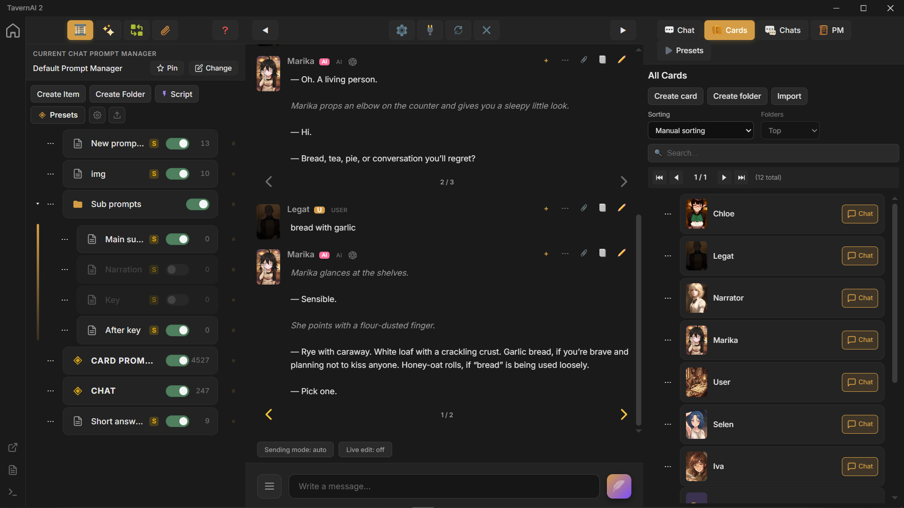

# TavernAI 2

TavernAI 2 is a portable AI roleplay chat app built around character cards, branching scenes, custom prompts, visual context, and scripted scene logic.

It works with local and remote model providers, keeps chats and cards on your machine, and gives each scene room to grow beyond a single linear conversation.

<p align="center">
	
</p>

## Download

- [Windows 10, 11](https://github.com/TavernAI/TavernAI/releases/download/v2.1.0/TavernAI-v2.1.0-standard-win-x64.zip)
- [Linux](https://github.com/TavernAI/TavernAI/releases/download/v2.1.0/TavernAI-v2.1.0-standard-linux-x64.tar.gz)

VPS or Linux server install:

```bash
curl -fsSL https://tavernai.net/install.sh | bash
```

## What TavernAI 2 Does

- Portable app: download, extract, run. 100 mb size.
- Character-card chats with user-side and AI-side participants.
- Branching swipes: any message can become a new path in the same chat.
- Multi-generation: several AI replies can run at the same time.
- Dynamic chat participants: add, remove, reorder, or replace cards as the scene changes.
- Unified Prompt Manager for prompts, rules, placeholders, world info, and card-level context.
- Prompt attachments for files and images.
- Theme editor for interface-level customization.
- Pre-gen and post-gen Macros for prompt automation.
- Prompt Manager Scripts for interactive scene mechanics and AI games.
- Run local LLM visual models: CPU, CUDA, and Vulkan backends

## Documentation

Public documentation lives on the TavernAI website.

- [Getting Started](https://tavernai.net/docs/getting-started/)
- [Installation](https://tavernai.net/docs/installation/)
- [Quick Start](https://tavernai.net/docs/quick-start/)
- [Advanced features](https://tavernai.net/docs/advanced-features/)

This repository also contains documentation translation files in `docs-site/` when they are ready for community review.


## Legacy TavernAI

The original TavernAI repository is kept separately for TavernAI 1.x history and legacy reference.

- Legacy TavernAI repository: https://github.com/TavernAI/TavernAI-v1


## Community

- [Website](https://tavernai.net)
- [Discord](https://discord.gg/zmK2gmr45t)
- [GitHub Releases](https://github.com/TavernAI/TavernAI/releases)
- [Issues](https://github.com/TavernAI/TavernAI/issues)

## Repository Scope

This public repository is for releases, translations, public documentation mirrors, issue tracking, and community files.

Included here:

- app locale files in `locales/app/`
- public documentation mirror files in `docs-site/`
- release notes and changelog
- issue reports and community contribution flow


## Contributing

Community contributions are welcome for app translations, documentation translations, typo fixes, and issue reports.

Start with [CONTRIBUTING.md](CONTRIBUTING.md).

## Privacy

TavernAI is private by design. It does not collect telemetry, analytics, crash reports, or personally identifiable information.

The app does not make background network requests - no auto update checks, no load remote frameworks, fonts, scripts, or other external assets.
