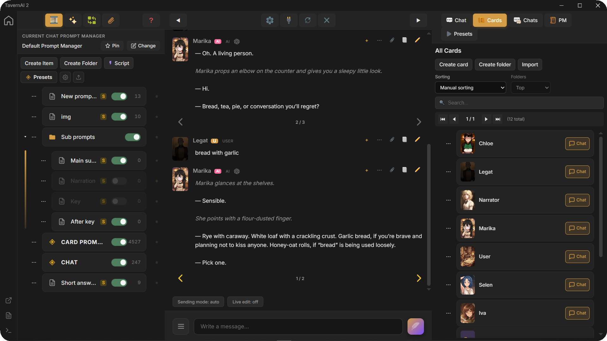
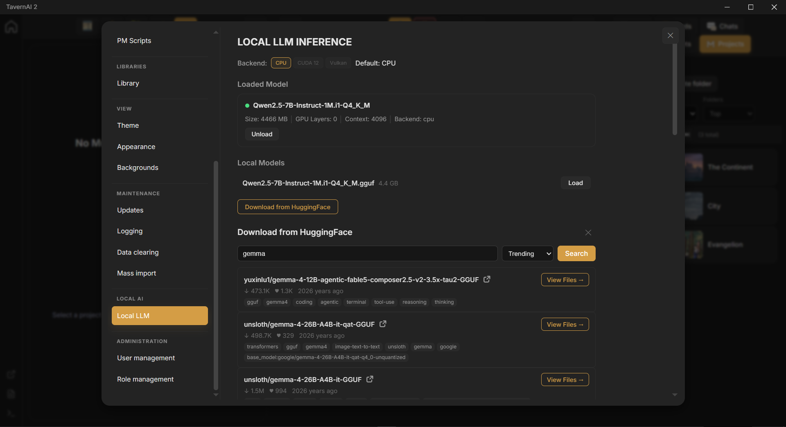
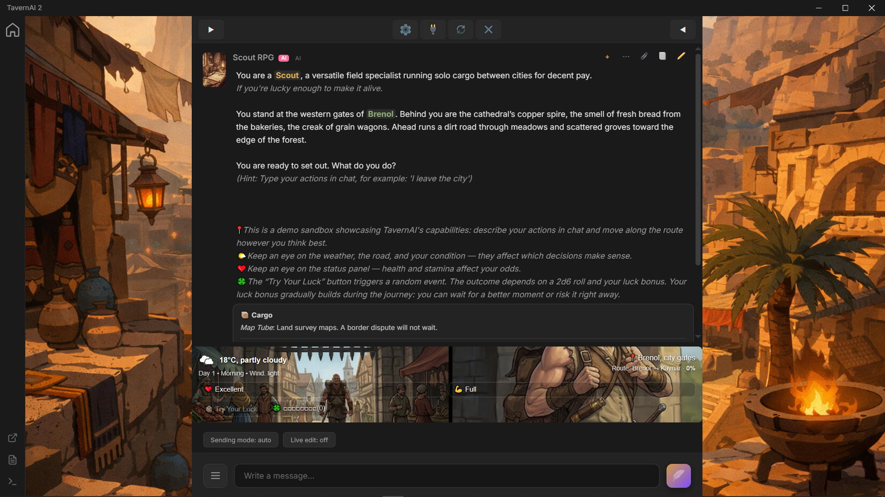
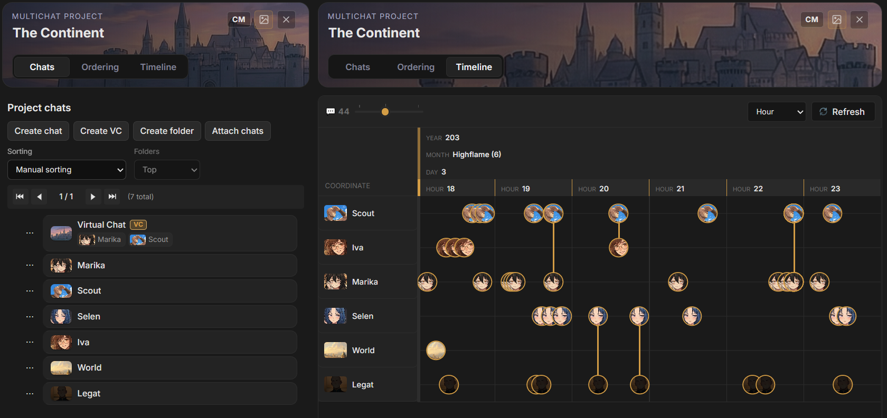
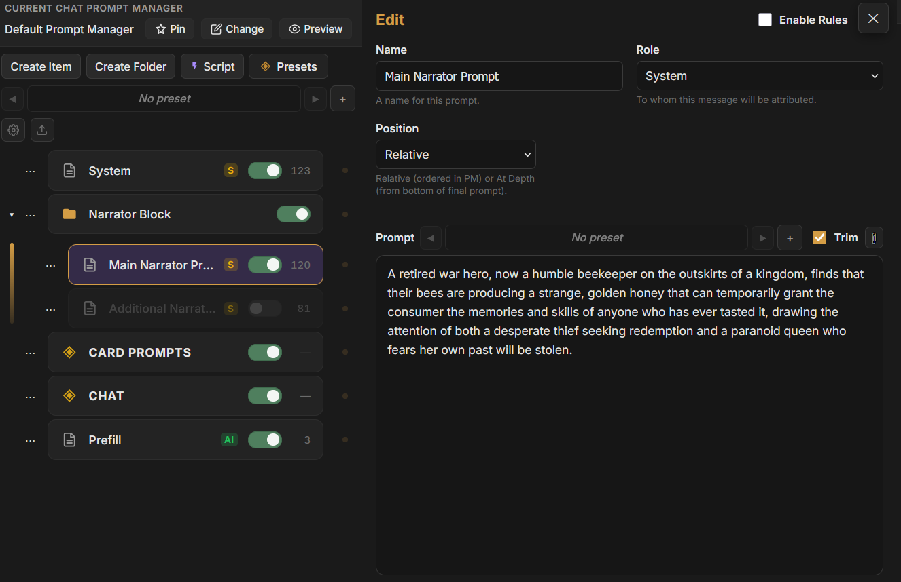
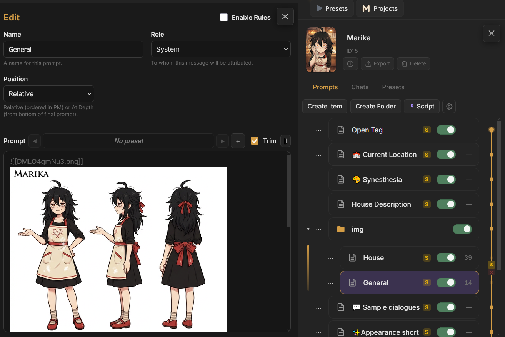
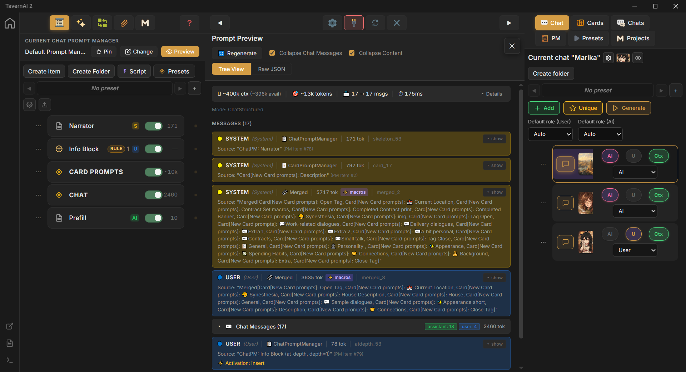
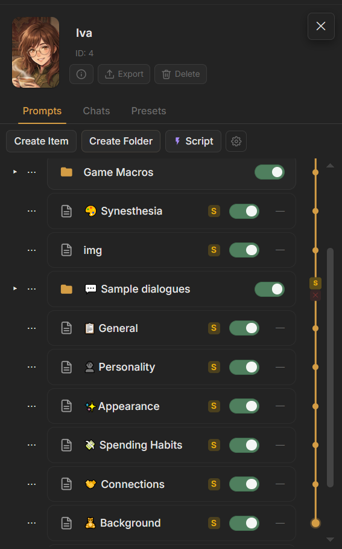
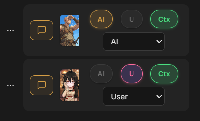
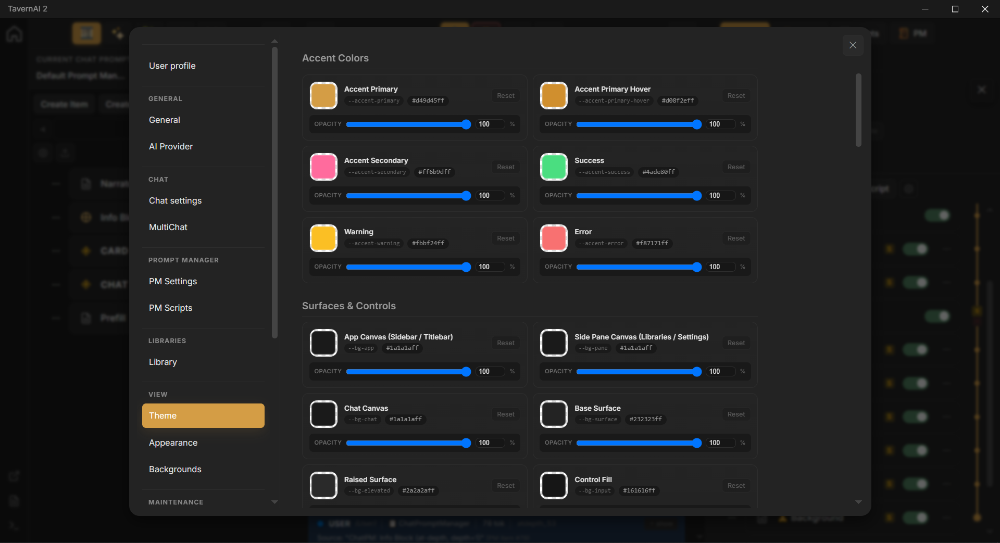

<div align="center">

<h1 align="center"> TavernAI 2</h1>

**A private, portable AI roleplay chat for characters, branching scenes, and complete prompt control.**

[](https://github.com/TavernAI/TavernAI/releases/latest)
[](https://github.com/TavernAI/TavernAI/releases)
[](https://discord.gg/zmK2gmr45t)

[Website](https://tavernai.net) &nbsp;&bull;&nbsp; [Documentation](https://tavernai.net/docs/getting-started/) &nbsp;&bull;&nbsp; [Discord](https://discord.gg/zmK2gmr45t) &nbsp;&bull;&nbsp; [Releases](https://github.com/TavernAI/TavernAI/releases)

</div>

<p align="center">
	
</p>

TavernAI 2 gives roleplay chats room to change. A scene can branch at any message, bring new characters into the cast, run several replies at once, and use its own prompts, rules, images, files, and scripts.

Chats, cards, settings, and generated data stay on your machine. Connect a remote AI provider or run local LLM and vision models through CPU, CUDA, or Vulkan backends.

## Download

| System | Package | Download |
| :-- | :-- | :-- |
| Windows 10 / 11 | Portable `.zip`, x64 (117 MB) | **[Download v2.2.3](https://github.com/TavernAI/TavernAI/releases/download/v2.2.3/TavernAI-v2.2.3-win-x64.zip)** |
| Linux | Portable `.tar.gz`, x64 (120 MB) | **[Download v2.2.3](https://github.com/TavernAI/TavernAI/releases/download/v2.2.3/TavernAI-v2.2.3-linux-x64.tar.gz)** |

For a VPS or Linux server:

```bash
curl -fsSL https://tavernai.net/install.sh | bash
```

## Beyond a Roleplay Chat

<table>
	<tr>
		<td width="42%" valign="top">
			<h3>Run Models Locally or connect to AI Provider.</h3>
			<p>Load GGUF language and vision models directly inside TavernAI with CPU, CUDA, or Vulkan. Or switch the same chat to more than a dozen built-in and custom API integrations.</p>
		</td>
		<td width="58%" valign="top">
			
		</td>
	</tr>
</table>

<table>
	<tr>
		<td width="42%" valign="top">
			<h3>Turn TavernAI into an AI Game Engine</h3>
			<p>Build interactive AI games with their own interface, persistent state, branching logic, scripts, prompts, and assets.</p>
		</td>
		<td width="58%" valign="top">
			
		</td>
	</tr>
</table>

<table>
	<tr>
		<td width="42%" valign="top">
			<h3>MultiChat — One World, Many Lives</h3>
			<p>Give every character their own history and knowledge. Bring their timelines together when they meet, preserve that shared event in each life, then let their stories separate and continue again.</p>
		</td>
		<td width="58%" valign="top">
			
		</td>
	</tr>
</table>

<table>
	<tr>
		<td width="42%" valign="top">
			<h3>Build the Prompt as a System</h3>
			<p>Control the entire generation pipeline with folders, activation rules, roles, placement, presets, token counters, structural nodes, and visual merge groups.</p>
		</td>
		<td width="58%" valign="top">
			
		</td>
	</tr>
</table>

<table>
	<tr>
		<td width="42%" valign="top">
			<h3>Drop Files Straight into the Prompt</h3>
			<p>Attach images, PDFs, documents, audio, video, or text directly to any prompt item. Files become part of the same context system as characters, scenes, and chat history.</p>
		</td>
		<td width="58%" valign="top">
			
		</td>
	</tr>
</table>

<table>
	<tr>
		<td width="42%" valign="top">
			<h3>See Exactly What the Model Sees</h3>
			<p>Open the final assembled prompt before generation: every role, source, token, attachment, transformation, and the raw request itself.</p>
		</td>
		<td width="58%" valign="top">
			
		</td>
	</tr>
</table>

<table>
	<tr>
		<td width="42%" valign="top">
			<h3>Every Character Is Its Own Prompt System</h3>
			<p>Build each character from an ordered prompt tree with any prompts, folders, rules, scripts, files, and structure it needs. The avatar, identity, and complete behavior travel together in one card.</p>
		</td>
		<td width="58%" valign="top">
			
		</td>
	</tr>
</table>

<table>
	<tr>
		<td width="42%" valign="top">
			<h3>Any Character Can Be AI, User, or Context</h3>
			<p>Add any number of participants and decide independently who generates replies, who represents the user, and whose information enters the model context.</p>
		</td>
		<td width="58%" valign="top">
			
		</td>
	</tr>
</table>

<table>
	<tr>
		<td width="42%" valign="top">
			<h3>Make the Entire Interface Yours</h3>
			<p>Rebuild TavernAI around your own colors, surfaces, typography, opacity, and chat style—then save the result as a reusable theme.</p>
		</td>
		<td width="58%" valign="top">
			
		</td>
	</tr>
</table>

## Documentation

- [Getting Started](https://tavernai.net/docs/getting-started/)
- [Installation](https://tavernai.net/docs/installation/)
- [Quick Start](https://tavernai.net/docs/quick-start/)
- [Advanced Features](https://tavernai.net/docs/advanced-features/)

Translation sources for the app live in [`locales/`](locales/). Documentation translation files live in [`docs-site/`](docs-site/) when they are ready for community review.

## Community and Contributions

Join the [TavernAI Discord](https://discord.gg/zmK2gmr45t). Bug reports and feature discussions belong in [GitHub Issues](https://github.com/TavernAI/TavernAI/issues).

Community contributions are open for app translations, documentation translations, typo fixes, and issue reports. Start with [CONTRIBUTING.md](CONTRIBUTING.md).

This repository contains releases, translations, public documentation mirrors, issue tracking, and community files. The original TavernAI 1.x repository remains available as the [legacy TavernAI repository](https://github.com/TavernAI/TavernAI-v1).

## Privacity
TavernAI has no telemetry, crash reporting, background update checks, remote fonts, or external frameworks.
