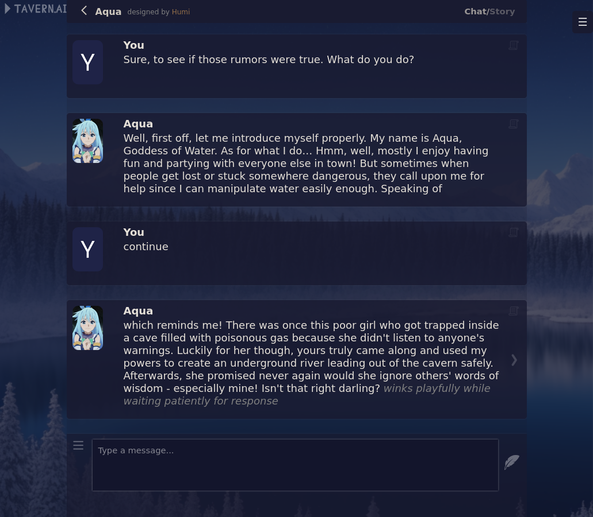

# TavernAI
### TavernAI is an atmospheric frontend for chat and storywriting, compatible with many backends!
**Screenshots:**
 

###### Download: 
* [Windows .exe](https://sourceforge.net/projects/tavernaimain/files/TavernAI.rar/download) | [Node.js version](https://github.com/TavernAI/TavernAI/archive/refs/heads/main.zip) 
###### Run online: 
* [TavernAI on Google Colab](https://colab.research.google.com/github/TavernAI/TavernAI/blob/main/colab/GPU.ipynb)
###### Links: 
* [TavernAI on Boosty](https://boosty.to/tavernai) - Support the project!
* [TavernAI Discord](https://discord.gg/zmK2gmr45t) - Meet the community!

## Features
* Character creation
* Online character database
* Group chat with multiple characters at the same time
* Story mode
* World info
* Message swiping
* Configurable generation settings
* Configurable interface themes, including one that resembles CharacterAI
* Configurable backgrounds, including beautiful defaults to select from
* Edit, delete, and move any message

## How to install
1. Download and install: [Node.js](https://nodejs.org/dist/v20.8.0/node-v20.8.0-x64.msi)
2. Download [TavernAI](https://github.com/TavernAI/TavernAI/archive/refs/heads/main.zip)

Then:
- **On Windows:** Start TavernAI by running `Start.bat`
- **On Linux:** Start TavernAI by running `start-linux.sh`
- **On other OSes:**  Run `npm install` to install dependencies, then run `node server.js` to start the server

For detailed instructions on how to setup TavernAI with KoboldAI or NovelAI:
- [KoboldAI](https://github.com/TavernAI/TavernAI/wiki/How-to-install)
- [NovelAI](https://github.com/TavernAI/TavernAI/wiki/How-to-install-Novel)

## Supported Backends
* Kobold series ([KoboldAI](https://github.com/KoboldAI/KoboldAI-Client), [KoboldCpp](https://github.com/LostRuins/koboldcpp), and [Horde](https://horde.koboldai.net/))
* [Oobabooga's Text Generation Web UI](https://github.com/oobabooga/text-generation-webui)
* OpenAI (including ChatGPT, GPT-4, and reverse proxies)
* [NovelAI](https://novelai.net/)

## Tips
Use this button to edit the message:

If the message is not finished, you can simply send the request again, or say "continue", depending on the model. It should understand that you want to continue the message.

## Additional materials
* [paniphons's guide to text generation](https://github.com/TavernAI/TavernAI/blob/main/faq.md)
* [Crataco's guide to text generation](https://github.com/Crataco/ai-guide)
## Contact
#### Humi (the original developer):
* Discord: Humi#5044
   
