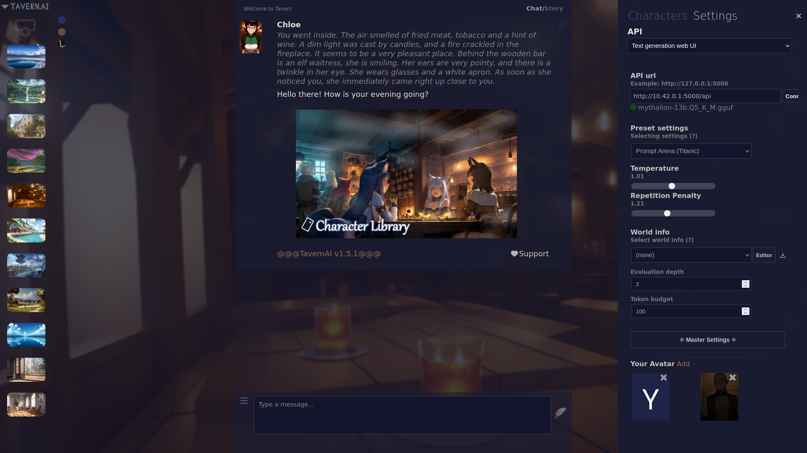
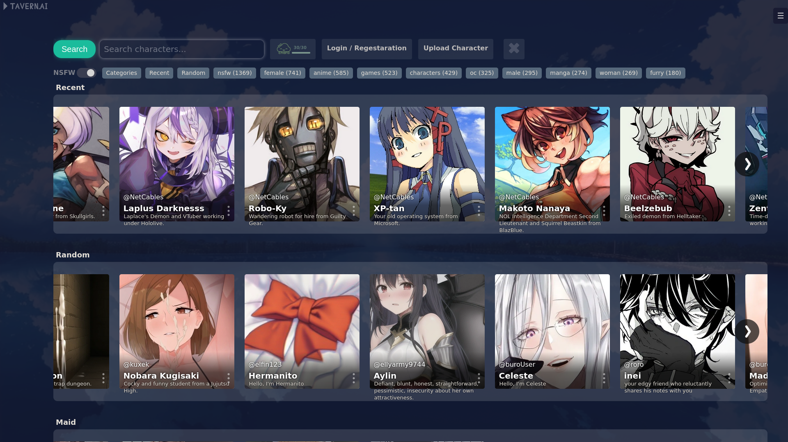
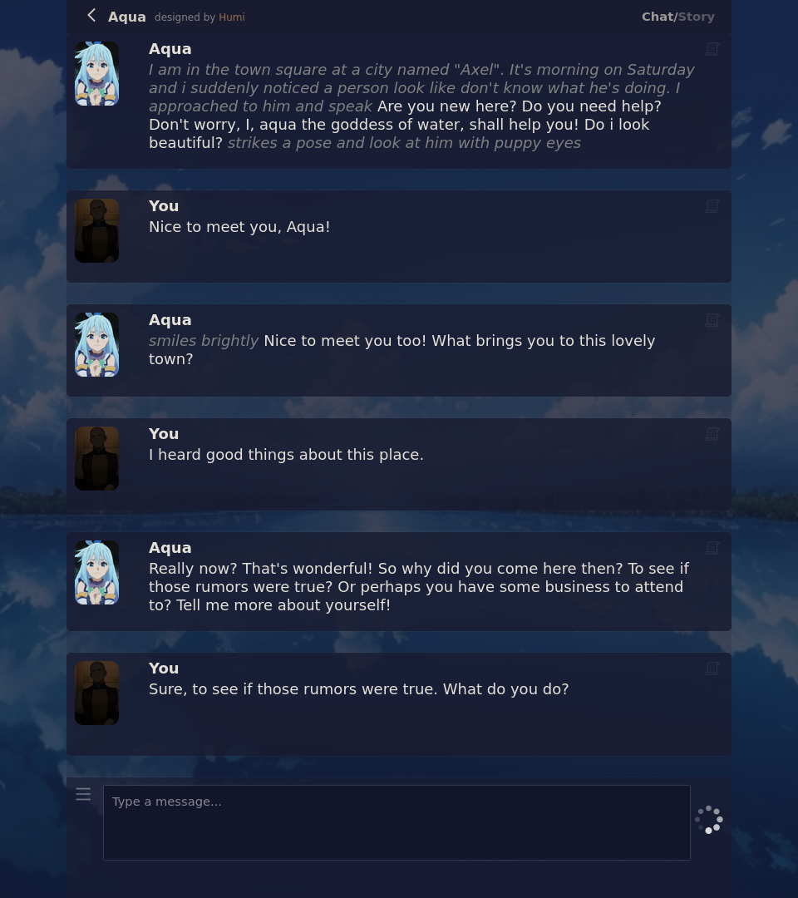
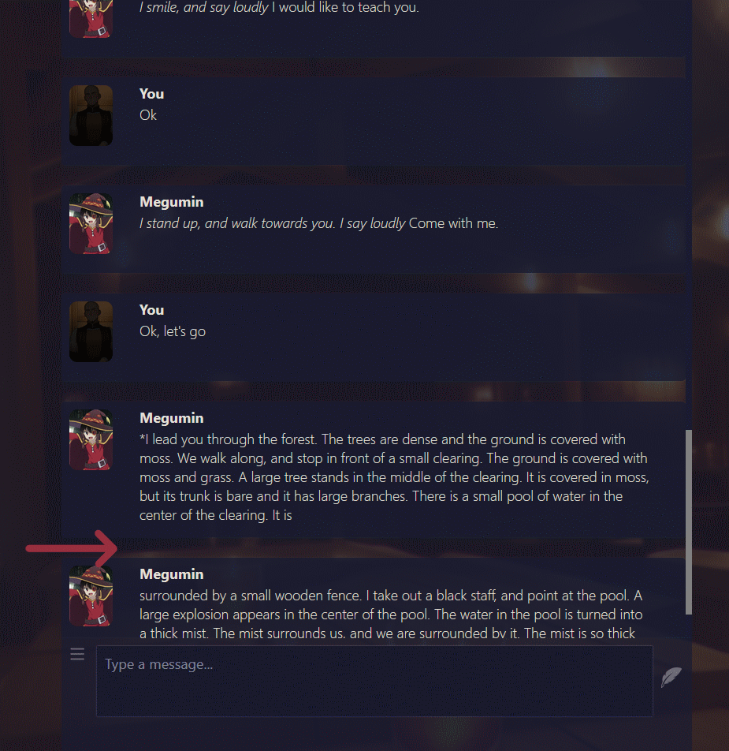

### TavernAI is a adventure atmospheric chat (KoboldAI, NovelAI, Pygmalion, OpenAI)
Examples of interface and output:
 

###### Download: 
* [Windows .exe](https://sourceforge.net/projects/tavernaimain/files/TavernAI.rar/download)&nbsp;&nbsp;|&nbsp;&nbsp;[Node.js version](https://github.com/TavernAI/TavernAI/archive/refs/heads/main.zip) 
###### Run online: 
* [TavernAI Colab](https://colab.research.google.com/github/TavernAI/TavernAI/blob/main/colab/GPU.ipynb) 
###### Links: 
* [TavernAI Boosty](https://boosty.to/tavernai)
* [TavernAI Discord](https://discord.gg/zmK2gmr45t)

## Features
* Creating characters with personality setup
* Online character library
* Supporting chat with multiple characters simultaneously
* Flexible settings for AI models
* Story mode
* World Info
* Swipes
* Choosing atmospheric backgrounds
* Editing/Deleting/Moving any messages
* KoboldAI Support
* Horde Support
* NovelAI support
* OpenAI Support
* Reverse Proxy server support

## How to install
### In Detail:
* [Install with KoboldAI](https://github.com/TavernAI/TavernAI/wiki/How-to-install) 
* [Install with NovelAI](https://github.com/TavernAI/TavernAI/wiki/How-to-install-Novel) 
### Briefly:
1. Download [TavernAI](https://github.com/TavernAI/TavernAI/archive/refs/heads/main.zip)
2. Install [Node.js v19.1.0](https://nodejs.org/download/release/v19.1.0/)
3. Run Start.bat (or use command: *npm install*, *node server.js*)
## AI Models
* [KoboldAI](https://github.com/KoboldAI/KoboldAI-Client)
* [NovelAI](https://novelai.net/)
* [Pygmalion](https://rentry.org/pygmalion-ai)
* [chatGPT](https://chat.openai.com/)
* [GPT-4](https://openai.com/research/gpt-4)

## Tips
Use this button to edit the message  
  
If the message is not finished, you can simply send the request again, TavernAI will understand that this is a continuation.  (Works with KoboldAI and NovelAI models, not with Pygmalion) 
 
## Additional materials
* [FAQ](https://github.com/TavernAI/TavernAI/blob/main/faq.md)
* [https://www.reddit.com/user/Crataco/comments/zuowi9/opensource_chatbot_companions/](https://github.com/TavernAI/TavernAI/blob/main/faq.md)
## For contacts
* Discord: Humi#5044
   
